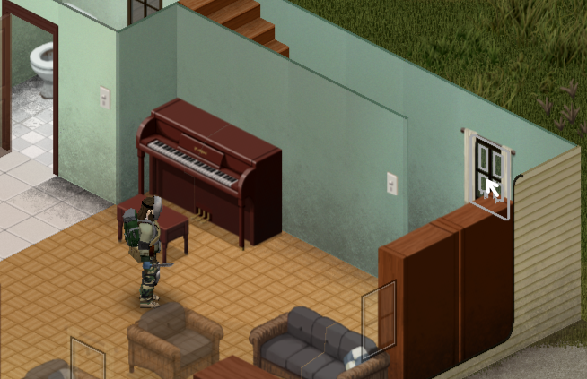

## Hover Highlighting

This is a small, client-side only mod for Project Zomboid. It highlights
interactables when hovering the mouse over them using the game's 'container open'
item highlight function.

I made this mostly to learn how to mod Project Zomboid, but also because I would
occasionally have issues trying to open the context menu with the mouse, especially on sinks and windows.

Currently uses the color defined for the game's container open highlight.
Which you can set in the game options. This works for me, but if there is enough
demand I can make it configurable.

### Usage

Just subscribe, or put this into the 'Zomboid/mods' folder.

Linux:
/home/<YourUsername>/Zomboid/mods on Linux

Windows: C:\Users\<YourUsername>\Zomboid\mods

### Compatibility

This *should* not cause any problems (I think), it might have issues highlighting mod interactables.

Leave a comment or maybe open an issue on Github if there are mod items that
this mod misses. No promises, but if I have enough time I will attempt to make
this work with other mods.

### Under the hood

This works by roughly determining whether an object adds an option to the
context menu. Several other checks are necessary, for example, the walls
that contain a window add window context options, so I check if the object
has a window in it instead. This might lead to some strange behavior
with player built objects, so let me know if you are or aren't seeing something
highlighted that should or shouldn't.

I did use AI when writing the code and learning Project Zomboid internals. But
images, this readme, and anything I write intended directly for human consumption
is written by me.
